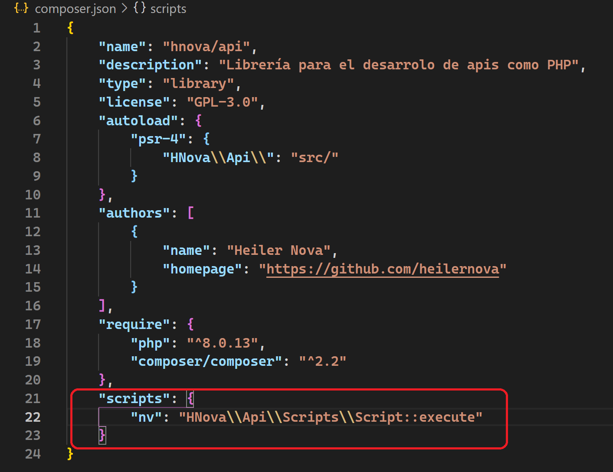
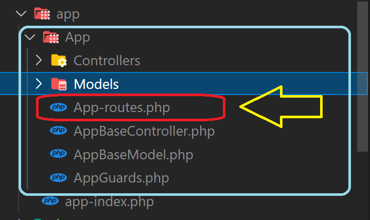

# HNova - Api

Librería de PHP para el desarrollo de apis

package de compsoser [Aquí](https://packagist.org/packages/hnova/api)

### Programas requeridos
* [XAMMP](https://www.apachefriends.org/es/download.html) Instalar la versión con php 8.0.13 o superior
* [Composer](https://getcomposer.org/download/)
* Editor de código puede ser [Visual Studio Code](https://code.visualstudio.com/);
### Programas opcionales
* [Postman](https://www.postman.com) : Applicación para testear las rutas de la API, pude realizar la descarga [aquí](https://www.postman.com/downloads/)

## Recomendaciones
En caso de utilizar [Visual Studio Code](https://code.visualstudio.com/), pude utilizar las siguienstes extenciones para facilitar el desarrollo y la comprensión del código.
* [Bracket Pair Colorizer 2](https://marketplace.visualstudio.com/items?itemName=CoenraadS.bracket-pair-colorizer-2)
* [Material Icon Theme ](https://marketplace.visualstudio.com/items?itemName=PKief.material-icon-theme)
* [PHP Intelephense](https://marketplace.visualstudio.com/items?itemName=bmewburn.vscode-intelephense-client)

## Instalación

Para instalar la librería en tu proyecto debe ejecutar el siguiente comando en la consola de composer, aun no hay primara versión por lo tanto de debe instalar la versión en desarrollo con dev-main
```powershell
composer require hnova/api dev-main
```
Una vez terminada la ejecución del comando anterior se debe agregar los scripts al composer.json de su proyecto para acceder a los script de la libreria HNova/api.

Pegue el siguiente código el su archivo composer.json.
```json
"scripts": {
    "nv":"HNova\\Api\\Scripts\\Script::execute"
}
```

Debería quedar com se muestra el la imgamen.



### Script disponibles

* `composer nv install` o `composer nv i` => Crea los ficheros necesarios para el el funcionamiento de la API
* `composer nv g c (name)` => Crea un controldor en la app
* `composer nv g m (name) (name)` => Crea un modelo en la app
* `composer nv g api (name)` => Crea una nueva app de acceso a la API

#### composer nv install / composer nv i
Ambos formatos son valitos "i" y "install", al ejecutar este comando creara la carpeta src donde alojara el código para gestion de la API.

Nota: En caso de la carpeta src este creada y tenga contenido no se ejecutara la instalación.

Importante: Una vez ejecutado el script de debe actualar el autoload de composer ejecutando el comando `composer dump-autoload`

#### composer nv g c (name)
Crea un controlador para ser accedito por la ruta. al ejecutar este comando creara un archivo con el nombre ingredado en caso de que el controlador ya se encuentre creado retornara un error informando que le nombre del controlador ya esta en uso

Nota: En caso de que de hallan creado mas una pai debera agregar en el script el nombre de la API a la cual se le crearar el controlador.

Informacion: el nombre del controladro se definira el formato "PascalCase" donde cada palabra inicia con una mayuscula, recomienda que los nombre se lo mas cortos posibles y que hagan referencias a su acción, por defecto se le agregara la palabra Controller al nombre. 

Ejemplos: `TestController`, `PersonsController` , `UsersLocksController`

#### composer nv g m (name) (table)
Crea un modelo para interactuar con la base de datos, el script costa del cuerpo princiapal `composer nv g m` y dos parametros `name` y `table`, en cado de haber mas de una API debe especificar el nombre a la cual se le creara el modelo.

Nota: Por defecto la conexión de la base de datos utilizara la de la API ejecuta. en caso de personalizar la conexión a la base datos utilize los flaz en en la base de datos --db:name_databse

## Creación del entorno de trabajo.
Para iniciar con el desarrollo de la api debe ejecutar el siguiente comando mediente consola ne la raiz del proyecto
```
composer nv i
```
El script preguntara que nombre que desae darle a la primera api por defecto de asigna el nombre de `app`, una vez terminado el proceso en la cartea `src` encontraremos los archivos PHP para el funcionamiento de la API y el el directorio princiapal un archivo json llamado `api.json` el cual contiene las configuraciones del sistema.

Importante actualizar el autoload de composer mediante el siguiente comando `composer dump-autoload`

## Configuración de api.json
En el fichero `api.json` contiene un objeto JSON con las configuraciones para el funcionamiento de la API con el siguiente formato.
```json
{
    "name": "Applicaction name",
    "timezone": "UTC",
    "user": {
        "username": "admin",
        "password": "$2y$04$509QXMvRyLa6c6IkMt/D.exs/.S2UrQIvdl2QJ2pcr.GlYCU3QzrG",
        "email": null
    },
    "developers": [
        {
            "name": "Name developer",
            "email": "email@email",
            "homepage": null
        }
    ],
    "debug": true,
    "databases": {
        "test": {
            "type": "mysql",
            "dataConnection": {
                "hostname": "localhost",
                "username": "root",
                "password": "",
                "database": "test"
            }
        }
    },
    "apis": {
        "app": {
            "namespace": "App",
            "disable": false,
            "dirResources": "",
            "database": "test",
            "cors": {
                "origin": null,
                "headers": null,
                "methods": null
            }
        }
    }
}
```

En este archivo podremos 

## Rutas
Las rutas de acceso a la api de deberan definir en el archivo `App-routes.php` encontrado en la carpeta de cada app, cabe recalcar el nombre del archivo hace referencia al nombre de app por lo tanto el nombre biene definido por el namespace mas -routes.php.

Para definir las ruta utilizaresmo la clase estaticasa `HNova\Api\Routes`, la cual contiene métodos para agrear rutas según el HTTP METOHOD requerido.

Ejemplo del archivo routes: allí podremos detallar el el nombre hacer referencia a la API en este caso de nombre App



En este archivo entraremos el siguiente código.

```php
/**
 * Ingrese aquí las rutas de acceso de la api
 */
namespace App\Controllers;

use App\AppGuards;
use HNova\Api\Response;
use HNova\Api\Routes;

Routes::get("test", function(){ 
  return new Response("Hola mundo tetst"); 
});

Routes::get("test/saludo/{nombre:string}", function(string $nombre){ 
  return new Response("Hola mundo  $nombre");
});
```

## Protección de rutas
Para limitar el acceso a las rutas utilizaremos los guards los cuales estan alojado en la clase `AppGuards` alojada en el archivo `src/App/AppGuards.php`.

Esta es un clase estatica como métodos que retorna `callable` "funciones" para ejecutarse antes ingresar a la acción de la ruta, estas funciones deben retorna null o un objeto `HNova\Api\Response`, donde null es permitir el acceso y Objeto es negar el acceso.

```php
/**
 * En esta clase puede agregar las restrcicioines de aceceso a las rutas del sistema
 * mediante el uso del los guard almacenso el calse estatica.
 * 
 * todos los método deverar retorna un callable
 */

namespace App;

use HNova\Api\Response;

class AppGuards
{
    public static function authenticate():callable
    {
        /**
         * el guard es un función que retunr null para dar acceso al sistema.
         * en caso de retrona un Response no se podra accesder al controlador de la ruta.
         *
         * en este caso todas la ruta que implemento el el guard authenticate dependerar de que el
         * randim_int sea igual a 1 para acceder al controlador asignado a la ruta. 
         */
        return function(){
            if (random_int(1,2) == 1){

                // Retornamos null para que dar acceso.
                return null;
            }else{

                // Retornameos un Response para negar el acceso.
                return new Response('No access',  401);
            }
        };
    }
}
```

Para implementar el guard el ruta debebmos ingresar el llamdo del métodos de los guards a utilizar en el parametro canActivate, el cual espera un array con los guards a utilizar.

Nota: podremos utilizar mas de un gards en la misma ruta.
```php
Routes::get("test", function(){ return new Response("Hola mundo tetst"); } , [AppGuards::authenticate()]);
```

### Ruta con parámetros
Lo parametros se asigna entre llaves el nombre del parametro y serparado por ":" el tipo de dato esperado por defecto se un string ejemplo : "test/{name:string}" , "test/{year:int}"; los tipos de datos que soporta son enteros, decimales y strings (int, float, string)

Importante que los parametros de la funcion ya sean de callable o la clse controlador concuerden con el nombre y el tipo de parametro esperado en la función o métohod

```php
Routes::get("name/{name:string}", function(string $name){ return new Response("Hola $name"); });
Routes::get("year/{year:int}", function(int $year){ return new Response("El año es: $name"); });

// Retornaria un error porue el parámetro de la URL es de tipo string y el parámetro de la funcion es int.
Routes::get("error/{num:string}", function(int $num){ 
    $num++;
    return new Response("Numero mas 1; $num"); 
});
```
#### LLamado a un controlador.
Para asignarle un controlador a la ruta ingresaremos en el parámetro action un array con el nombre de la clase y el método a ejecutar.

En caso de no definir el método de la clase a ejecutar por defector buscara el método que concuerde la el tipo de la petición HTTP realizada (get, post, delete, put, patch).s

Nota: para obtener le nombre de la clase puese utiliar ::class

Error: retorna error 404 en caso de que el método no se encutre en la clase
```php
Routes::get("test/hello", [TestController::class, "hello"]);

// Buscara el método post de la clas TesController
Routes::post("test/hello", [TestController::class]);
```

## Utilidades para Angular
En caso de validar los mensaje del sistema en Angular, se recomienta utilizar un interceptor para el manejo de errores

Código para el interceptor
```ts
import { Injectable } from '@angular/core';
import {
  HttpRequest,
  HttpHandler,
  HttpEvent,
  HttpInterceptor,
  HttpErrorResponse,
  HttpResponse
} from '@angular/common/http';
import { catchError, map, Observable, throwError } from 'rxjs';

@Injectable()
export class NvApiInterceptor implements HttpInterceptor {

  static urlDefault:string|undefined = undefined;

  constructor(
    private _message:NvMessageBoxService
  ) {}

  intercept(request: HttpRequest<unknown>, next: HttpHandler): Observable<HttpEvent<unknown>> {

    let url:string = request.url;
    
    if (NvApiInterceptor.urlDefault){
      if (!url.match(/^http(s)?:\/\/(.*)$/)){
        url = `${NvApiInterceptor.urlDefault}/${url}`;
      }
    }

    let requestClone:HttpRequest<unknown> = request.clone({url});

    return next.handle(requestClone).pipe(
      map((event:HttpEvent<any>)=>{
          if (event instanceof HttpResponse ){
            let bodyObject = this.getBodyResponse(event.body);
            
            // Validas si la repuesta concuerda con ResponseApi de la libreria HNova/api
            if (bodyObject){

              if (bodyObject.status){
                // En caso de ser true establecemos el body con el contenido de la data.
                if (bodyObject.message.content.length > 0){
                  
                  // Aquí el codigo par al manejo del mensaje.
                }
                event = event.clone({body: bodyObject.data});
              }else{
                // En caso de retornar false devolvemos un error
                throw new HttpErrorResponse({error: bodyObject.message, url: event.url ?? '', status: event.status});
              }

            }
          }
        return event;
      }),
      catchError((e:HttpErrorResponse)=>{
        
        let text:string = "Error inesperado";
        let ms = this.getMessage(e.error);

        if (ms){
          if (ms.content.length > 0){
            // Aquí el codigo par al manejo del mesaje del servidror.
            
          }
        }else{
          if (typeof e.error == 'object'){
            text = e.message;
            
          }else if (typeof e.error == "string"){
            text = e.error;

            // Aquí el codigo par al manejo del mensjaer de error del servidor.
          }
        }
        
        return throwError(()=>e);
      })
    );
  }

  private getMessage(data:any):{title:string, content:(string|string[])[], type:number}|null{
    try {
      if ('title' in data && 'content' in data && 'type' in data){
        return data;
      }else{
        return null;
      }
    } catch (error) {
      return null;
    }
  }

  private getBodyResponse(data:any):{status:string, statusCode:number, message:{title:string, content:(string|string[])[], type:number}, data:any}|null{
    try {
      if ('status' in data && 'statusCode' in data && 'message' in data && 'data' in data){
        return data;
      }else{
        return null;
      }
    } catch (error) {
      return null;
    }
  }
}

```
