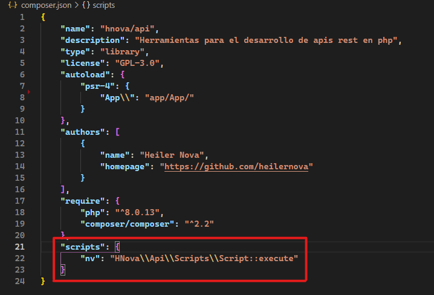

# HNova - Api

Librería de PHP para el desarrollo de apis

## Requerimientos

* `XAMMP` https://www.apachefriends.org/es/download.html Instalar la versión con php 8.0.13 o superior
* `Composer` https://getcomposer.org/download/

## Intalación

Para instalar la librería en tu proyecto debe ejecutar el siguiente comando en la consola de composer, aun no hay primara versión por lo tanto de debe instalar la versión en desarrollo con dev-main
```powershell
composer require hnova/api dev-main
```
Una vez terminada la ejecución del comando anterior se debe agregar los scripts al composer.json de su proyecto para acceder a los script de la libreria HNova/api.

Pegue el siguiente código el su archivo composer.json.
```json
"scripts": {
    "nv":"HNova\\Api\\Scripts\\Script::execute"
}
```

Debería quiedar de la siguiete manera.


### Script disponibles

* `composer nv install` o `composer nv i` => Crea los ficheros necesarios para el el funcionamiento de la api
* `composer nv g c` => crea un controldor en la app
* `composer nv g m` => crea un modelo en la app
* `composer nv g api` => crea una nueva app de acceso a la api

## Creación del entro de trabajo.
Para iniciar con el desarrollo de la api debe ejecutar el siguiente comando mediente consola ne la raiz del proyecto
```
composer nv i
```
El script preguntara que nombre que desae darle a la primera api por defecto de asigna el nombre de `app`, una vez terminado el proceso entraremos en la cartea `app` los archivos PHP para el funcionamiento de la api y el el directorio princiapal un archivo json llamado `api.json` el cual contiene las configuraciones del sistema.

### Rutas de acceso
Las rutas de acceso a la api de deberan definir en el archivo ``App-routes.php`` encontrado en la carpeta de cada app, cabe recalcar el nombre del archivo hace referencia al nombre de app por lo tanto el nombre biene definido por el namespace mas -routes.php.

#### Definir un ruta que ejecuta una función
```php
namespace HNova\Api\Panel\Controllers;

use HNova\Api\Api;
use HNova\Api\Http\ResponseApi;
use HNova\Api\Response;
use HNova\Api\Routes;

Routes::get("test", function(){
    return new Response("Hola mundo");
});
```